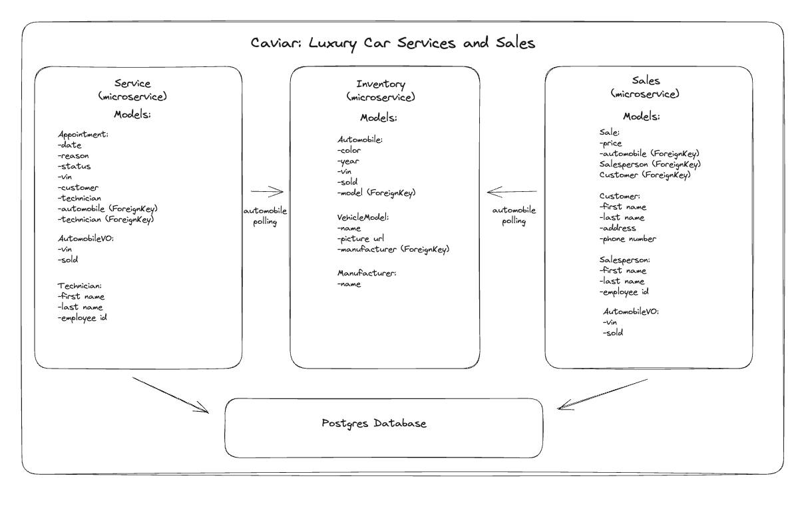

# Caviar: Luxury Car Service and Sales

About:\
This project was built using Django for the backend, with a Postgres database. Docker is used for creating a stable environment to deploy the project in. React was used for the front end, along with some help from axios, and styled components.\
:no_entry_sign:	Absolutely NO bootsrap or comparable style libraries were used in the creation of this project.

This application is designed for internal dealership use. The expected users would be dealership management and team leads for the monitoring of sales and service activities, as well as current inventory.

Team:
* Jessica Dickerson - Service backend and frontend
* Ian Norstad - Sales backend and frontend

## Running the Project

1. Fork and clone the repository
2. From terminal cd into the project directory
3. Make sure Docker desktop is running, and run the following commands in your terminal:
- docker volume create beta-data
- docker-compose build
- docker-compose up

_Disregard a potential error that may pop-up related to 'missing an environment variable.' This does not affect performance_

To view the project, open http://localhost:3000/ in your browser

# App Design

### Polling
Pollers have been built for both microservices. They poll automobile data from the Inventory database every 60 seconds.

### Service Microservice
The microservice for all actions and informaton related to the service department of the dealership. The primary actions are to add technicians, add appointments, and update appointment statuses.

### Sales Microservice
The microservice for all actions and information related to the sales department of the dealership. Primary actions include adding customers, salespeople, and sales records to the database, as well as the ability to delete them.

### Service Models
1. AutomobileVO: this model is created by the poller function. It saves the automobile's vin and sold status by pulling the data from the Automobile model in Inventory.
2. Technician: saves a technician's employee id number, first name, and last name.
3. Appointment: saves the appointment time, reason, status, and customer. Also records the automobile VIN and the technician performing the service. There is a many to one relationship with the Technician and Appointment model, as well as the Appointment and AutomobileVO.

### Sales Models
1. AutomobileVO: this is the model created by the poller function. It saves vin and sold status by pulling the data from the Automobile model in Inventory.
2. Customer: saves the first name, last name, address, and phone number.
3. Salesperson: saves the first name, last name, and employee ID.
4. Sales: saves the price, as well as the information of the customer, employee, and automobile, all as ForeignKeys.

## Endpoints

### Service

### Sales Endpoints

### Automobile Endpoints

### Manufacturers Endpoints

### Models Endpoints

